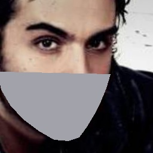

# 口罩人脸识别(Mask-face-recognition)
##### 原始github:https://github.com/HouchangX-AI/Mask-face-recognition
### 由来
这个项目主要是实现人脸特征向量的提取，关注点是实现CBAM以及face_attention，让网络集中关注不戴口罩的人脸区域
### 数据
正常人脸训练数据：VGGFace2，链接：http://www.robots.ox.ac.uk/~vgg/data/vgg_face2/ <br>
正常人脸测试数据：LFW(Labeled Faces in the Wild)，链接：http://vis-www.cs.umass.edu/lfw/ <br> 
口罩人脸数据：Real-World-Masked-Face-Dataset，链接：https://github.com/X-zhangyang/Real-World-Masked-Face-Dataset <br>   
### 模型
以标准人脸识别模型FaceNet为主线，添加Attention结构，增加CBAM模型，使其能更好的聚焦于人脸上半部，没带口罩的区域<br>
这里提供了三个版本的模型，一个是戴口罩的模型V1和V2，一个是没带口罩的模型V3，带口罩的模型V1和V2的区别仅在于训练网络不同<br>

### 下载相应数据
生成一个Datasets文件夹，把VGGFace2的原始数据(VGGFace2_train文件)、LFW原始数据(lfw_funneled)、LFW配对文件(LFW_pairs.txt)，都放到Datasets文件夹，并解压，VGGface是用做训练集的，LFW是用做测试集的<br>

### 清洗数据过程 非必需
清洗相关小图，原始数据质量不过关，可以把尺寸太小的图删了：<br>
使用Data_preprocessing/kill_img.py文件，在preprocess函数中设定图像尺寸大小，现在可能用的是250，也就是只保留边长250以上的图片，而后将data_path指定到VGGFace2_train文件夹，这里是原位操作，所以就直接在这个文件夹里删除所有小图了，如果不想这样的话可以先备份一遍数据，然后运行了就会显示删了多少图、保留了多少图、总图数是多少。<br>

##### 文件名有_notmask后缀的是不戴口罩的代码，文件名有_mask后缀的是戴口罩的代码
### 不戴口罩数据预处理
不戴口罩切人脸/对齐/生成mask(数据预处理，用OpenCV把图像中的人脸切下来，做2轴对齐，在根据68人脸特征点生成Attention模块用的mask图)：<br>
使用Data_preprocessing/Image_processing.py，设置notmasked=True；masked=False其中的‘shape_predictor_68_face_landmarks.dat’[官方下载地址](http://dlib.net/files/shape_predictor_68_face_landmarks.dat.bz2) ，就是OpenCV库的68人脸特征点预测模型，然后定义输入data路径就可以运行了。处理VGGface2大约要一天时间<br>
如果想加快生成速度，可以分片生成，使用命令行也可以写到一个shell脚本里面
```bash
示例：分成10份生成，总的生成时间会缩减为之前的十分之一
cd /Data_preprocessing 
python Image_processing.py -s1 0 -s2 1 -sa 10
python Image_processing.py -s1 1 -s2 2 -sa 10
python Image_processing.py -s1 2 -s2 3 -sa 10
...
python Image_processing.py -s1 9 -s2 10 -sa 10
这样数据生成时间可以缩减很多，根据CPU的情况而定，如果之前要一天时间现在只要几个小时就可以处理完
```
<br>
数据清单生成，先把所有数据文件信息存到csv文件里以后就不用每次都读了：   <br>
使用Data_preprocessing/Make_csv_file_notmask.py，输入数据文件夹路径、输出csv文件路径，然后就能跑了，保存的csv格式形如：序号，图片名称，人名<br>
###### 生成结果展示
 
<i></i>

### 戴口罩数据预处理
戴口罩切人脸/对齐/生成mask：<br>
使用Data_preprocessing/Image_processing.py，设置notmasked=False；masked=True，其中的‘shape_predictor_68_face_landmarks.dat’[官方下载地址](http://dlib.net/files/shape_predictor_68_face_landmarks.dat.bz2) ，就是OpenCV库的68人脸特征点预测模型，然后定义输入data路径就可以运行了。处理VGGface2大约要一天时间<br>
如果想加快生成速度，可以分片生成，仿照不戴口罩数据预处理<br>
<br>
数据清单生成，先把所有数据文件信息存到csv文件里以后就不用每次都读了：   <br>
使用Data_preprocessing/Make_csv_file_mask.py，输入数据文件夹路径、输出csv文件路径，然后就能跑了，保存的csv格式形：序号，图片名称，人名<br>
###### 生成结果展示
 
<i></i>

###### 设置notmasked=True；masked=True，则会同时生成带口罩的和不戴口罩的

### 配置文件理解
不戴口罩的修改config_notmask.py，戴口罩的修改config_mask.py文件 
```bash
model：18/34/50/101/152
num_train_triplets：这个是随机生成训练三元组的数量，10万就是10万个三元组共计30万张图
这些路径可以不需要修改，这里仅作为解释使用，路径已经配置好无需修改
train_triplets_path：这个是随机生成训练三元组的保存路径
test_pairs_paths：这个是随机生成测试三元组的保存路径
```
### 训练
```bash
戴口罩V1运行: python train_maskV1.py
戴口罩V2运行: python train_maskV2.py
不戴口罩V3运行: python train_notmaskV3.py
```
### 训练以后验证模型效果
验证测试过程中会采用戴口罩的LFW数据和不戴口罩的LFW数据，会打印输出相应的AUC结果，其中evaluate_lfw函数中的参数pltshow，用来控制是否保存ROC曲线图
模型是保存在Model_training_checkpoints文件夹里面，日志文件保存在logs文件夹里面

### ROC_AUC曲线图
</center>
</center>
</center>
<i></i>


### 两张图片对比向量距离
```bash
cd valid_test_compare
python compare.py
```
### 使用LFW验证测试集AUC结果
```bash
cd valid_test_compare
python validLFW.py
```
### 非LFW数据集生成LFW格式的pairs.txt文件
```bash
cd valid_test_compare
python create_pairs.py
```
### 使用非LFW数据集验证测试集AUC结果
```bash
cd valid_test_compare
python validNOTLFW.py
```

License
~~~~~~~
`Free software: MIT license <https://github.com/shiheyingzhe/Mask_face_recognitionZ/LICENSE>`_
Citation: YangQiHong, ZouJiu. Mask_face_recognitionZ. Git code (2020). https://github.com/shiheyingzhe/Mask_face_recognitionZ