# 口罩人脸识别(Mask-face-recognition)
##### 原始github:https://github.com/HouchangX-AI/Mask-face-recognition
### 由来
这个项目主要是实现人脸特征向量的提取，关注点是实现[CBAM](https://arxiv.org/abs/1807.06521) 模块以及[face_attention](https://arxiv.org/abs/1711.07246) 模块，让网络集中关注不戴口罩的人脸区域并提升识别率<br>
### 环境
CUDA Version: 10.2<br>
CUDNN Version：7.6.5<br>
Pytorch：1.6.0<br>
### 数据
正常人脸训练数据：VGGFace2，链接：http://www.robots.ox.ac.uk/~vgg/data/vgg_face2/ <br>
正常人脸测试数据：LFW(Labeled Faces in the Wild)，链接：http://vis-www.cs.umass.edu/lfw/<br>
LFW数据集下载的链接是[https://share.weiyun.com/qHg5TcPP](https://share.weiyun.com/qHg5TcPP) ，放入Datasets文件夹<br> 
口罩人脸数据：Real-World-Masked-Face-Dataset，链接：https://github.com/X-zhangyang/Real-World-Masked-Face-Dataset，项目中暂时没用到可以不管<br>   
### 模型
以标准人脸识别模型[FaceNet](https://arxiv.org/abs/1503.03832) 为主线，添加fpn_face_attention结构，增加CBAM模块，使其能更好的聚焦于人脸上半部，没带口罩的区域<br>

有几个版本的face_attention提取层，表格里面的FA_*，代表face_attention版本号，V6是基准网络只有Resnet34没加任何其他网络结构，输入只有戴口罩人脸<br>
AUC的结果是运行validation_LFW.py文件得到的

| 版本号 | 网络 | CBAM | FA_1 | FA_Y | FA_2 | 输入人脸戴口罩 | 输入mask图片或矩形框坐标 | 戴口罩LFW测试AUC | 不戴口罩LFW测试AUC |
| ------ | ------ | ------ | ------ | ------ | ------ | ------ | ------ | ------ | ------ |
| V1 | Resnet34 | ✔ | ✔ |  |  | ✔ | 矩形框 | 0.751 | 0.808 |
| V2 | Resnet34 | ✔ |  |  | ✔ | ✔ | mask图片 | 0.799 | 0.919|
| V3 | Resnet34 | ✔ |  | ✔ |  | × | mask图片 | 0.768 | 0.950 |
| V6 | Resnet34 |  |  |  |  | ✔ | 不输入 | 0.835 | 0.922 |
| V8 | Resnet34 |  |  |  | ✔ | ✔ | mask图片 | 0.855 | 0.926 |
| V9 | Resnet34 | ✔ |  | ✔ |  | ✔ | mask图片 | 0.832 | 0.918 |

### 训练模型下载
下载好的模型放到Model_training_checkpoints文件夹里面<br>
V1对应网络模型：[https://share.weiyun.com/rwxg7wjK](https://share.weiyun.com/rwxg7wjK) <br>
V2对应网络模型：[https://share.weiyun.com/k2hbXlUf](https://share.weiyun.com/k2hbXlUf) <br>
V3对应网络模型：[https://share.weiyun.com/dlB3la3P](https://share.weiyun.com/dlB3la3P) <br>
V6对应网络模型：[https://share.weiyun.com/oahbBY9q](https://share.weiyun.com/oahbBY9q) <br>
V8对应网络模型：[https://share.weiyun.com/7mHXOuxS](https://share.weiyun.com/7mHXOuxS) <br>
V9对应网络模型：[https://share.weiyun.com/0dGsAUtO](https://share.weiyun.com/0dGsAUtO) <br>

### 下载相应数据
生成一个Datasets文件夹，把VGGFace2的原始数据(VGGFace2_train文件)、LFW原始数据(lfw_funneled)、LFW配对文件(LFW_pairs.txt)，都放到Datasets文件夹，并解压，VGGface是用做训练集的，LFW是用做测试集的<br>

### 清洗数据过程 非必需
清洗相关小图，原始数据质量不过关，可以把尺寸太小的图删了：<br>
使用Data_preprocessing/kill_img.py文件，在preprocess函数中设定图像尺寸大小，现在可能用的是250，也就是只保留边长250以上的图片，而后将data_path指定到VGGFace2_train文件夹，这里是原位操作，所以就直接在这个文件夹里删除所有小图了，如果不想这样的话可以先备份一遍数据，然后运行了就会显示删了多少图、保留了多少图、总图数是多少。<br>

##### 文件名有_notmask后缀的是不戴口罩的代码，文件名有_mask后缀的是戴口罩的代码
### 不戴口罩数据预处理
不戴口罩切人脸/对齐/生成mask(数据预处理，用OpenCV把图像中的人脸切下来，做2轴对齐，在根据68人脸特征点生成Attention模块用的mask图)：<br>
使用Data_preprocessing/Image_processing.py，设置notmasked=True；masked=False其中的‘shape_predictor_68_face_landmarks.dat’[官方下载地址](http://dlib.net/files/shape_predictor_68_face_landmarks.dat.bz2) ，就是OpenCV库的68人脸特征点预测模型，然后定义输入data路径就可以运行了。处理VGGface2大约要一天时间<br>
如果想加快生成速度，可以分片生成，使用命令行也可以写到一个shell脚本里面
```bash
示例：分成10份生成，总的生成时间会缩减为之前的十分之一
cd /Data_preprocessing 
python Image_processing.py -s1 0 -s2 1 -sa 10
python Image_processing.py -s1 1 -s2 2 -sa 10
python Image_processing.py -s1 2 -s2 3 -sa 10
...
python Image_processing.py -s1 9 -s2 10 -sa 10
这样数据生成时间可以缩减很多，根据CPU的情况而定，如果之前要一天时间现在只要几个小时就可以处理完
```
<br>
数据清单生成，先把所有数据文件信息存到csv文件里以后就不用每次都读了：   <br>
使用Data_preprocessing/Make_csv_file_notmask.py，输入数据文件夹路径、输出csv文件路径，然后就能跑了，保存的csv格式形如：序号，图片名称，人名<br>

###### 生成结果展示
这里生成不戴口罩的人脸图片以及口罩区域以上人脸的mask图片<br>
 
<i></i>

### 戴口罩数据预处理
戴口罩切人脸/对齐/生成mask：<br>
使用Data_preprocessing/Image_processing.py，设置notmasked=False；masked=True，其中的‘shape_predictor_68_face_landmarks.dat’[官方下载地址](http://dlib.net/files/shape_predictor_68_face_landmarks.dat.bz2) ，就是OpenCV库的68人脸特征点预测模型，然后定义输入data路径就可以运行了。处理VGGface2大约要一天时间<br>
如果想加快生成速度，可以分片生成，仿照不戴口罩数据预处理<br>
<br>
数据清单生成，先把所有数据文件信息存到csv文件里以后就不用每次都读了：   <br>
使用Data_preprocessing/Make_csv_file_mask.py，输入数据文件夹路径、输出csv文件路径，然后就能跑了，保存的csv格式形：序号，图片名称，人名<br>

###### 生成结果展示
生成戴口罩人脸和口罩以上人脸矩形框(xmin,0,xmax,ymax)txt文件<br>
 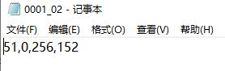
<i></i>

##### 设置notmasked=True；masked=True，则会同时生成带口罩的和不戴口罩的，V9模型需要这样设置，因为V9模型需要戴口罩人脸和以及口罩区域以上人脸的mask图片

### 配置文件理解
不戴口罩的修改config_notmask.py，戴口罩的修改config_mask.py文件 
```bash
model：18/34/50/101/152
num_train_triplets：这个是随机生成训练三元组的数量，10万就是10万个三元组共计30万张图
这些路径可以不需要修改，这里仅作为解释使用，路径已经配置好无需修改
train_triplets_path：这个是随机生成训练三元组的保存路径
test_pairs_paths：这个是随机生成测试三元组的保存路径
```
### 训练
训练最开始的时候会生成triplets图片对，生成的图片对会保存起来，以便之后使用
```bash
戴口罩V1运行: python train_maskV1.py
不戴口罩V3运行: python train_notmaskV3.py
戴口罩V9运行: python train_maskV9.py
```
### 训练以后验证模型效果
验证测试过程中会采用戴口罩的LFW数据和不戴口罩的LFW数据，会打印输出相应的AUC结果，其中evaluate_lfw函数中的参数pltshow，用来控制是否保存ROC曲线图,ROC曲线图保存在ROC_images文件夹里面<br>
模型是保存在Model_training_checkpoints文件夹里面，日志文件保存在logs文件夹里面

### ROC_AUC曲线图
左边的图片是使用不戴口罩的LFW测试图片，右边的图片是使用戴口罩的LFW测试图片
其中epoch后接的是epoch数，NOTMaskedLFW含义是不戴口罩的LFW测试集，MaskedLFW是戴口罩的LFW测试集，auc后接的是该测试集的auc结果
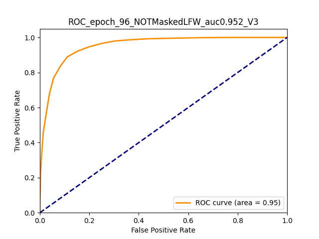 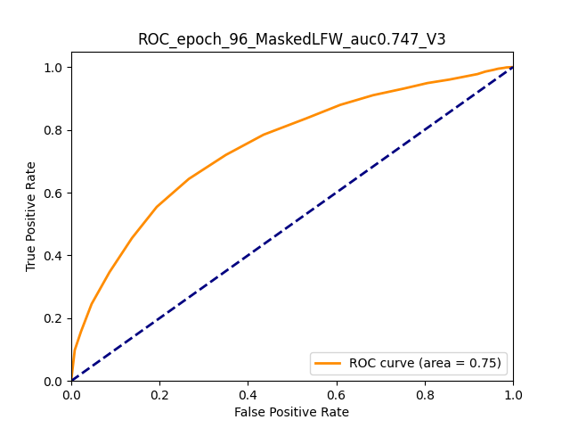
<i></i>
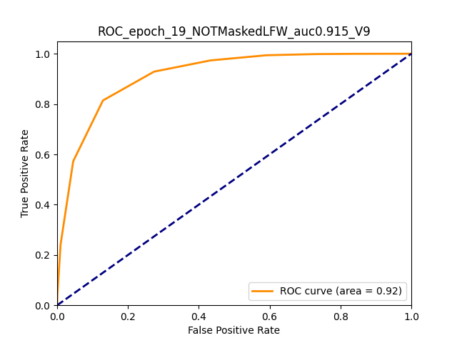 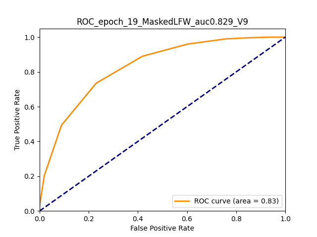
<i></i>
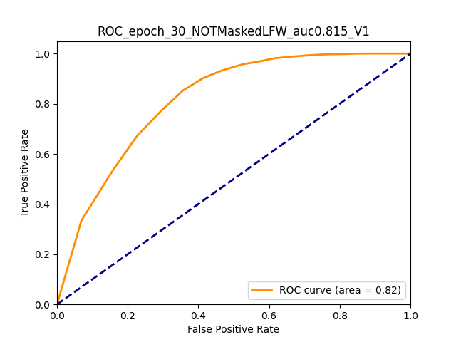 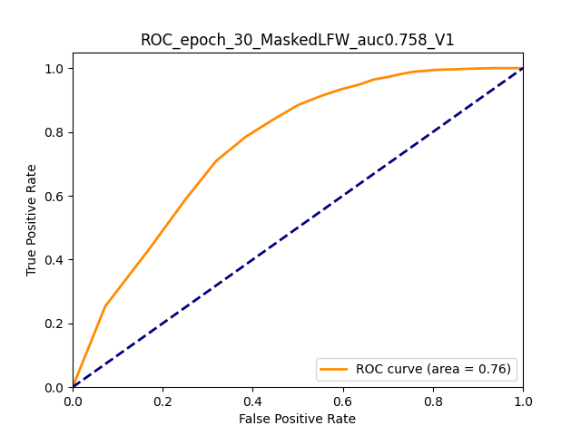
<i></i>

### 两张图片对比向量距离以及特征图可视化
保存的特征图在Layer_show文件夹里面，保存的是img2_path这张图片的特征图，version控制网络版本V1、V3和V9，mask控制人脸是否戴口罩，<br>
戴口罩的特征图保存在Layer_show/mask里面，不戴口罩的特征图保存在Layer_show/notmask里面<br>
dis2.972_faceshow_V3.jpg代表欧氏距离是2.972，V3代表使用的是V3版网络和模型，图中右边的是img2_path对应的图片<br>
fpnP3_V1.jpg代表V1网络模型中的fpn层中的P3层的特征图可视化，例外的是V3.jpg，因为V3网络没有FPN层，所以只有最后一层的可视化图片
```bash 
$运行文件会输出人脸向量距离以及特征图可视化图片
python compare.py
```
### 同一个人特征图可视化结果
这一张图片是由两张图片拼成的，是compart.py的输入图片，保存的特征图是img2_path这张图片的，也就是右边的这张图片，这里给出带口罩的和不戴口罩的测试拼接图片<br> 
图片里面的文字，dis:*代表两张人脸的特征向量的欧氏距离，有lay标记的是输出特征图的人脸<br>
V9网络戴口罩测试的结果 &emsp;&emsp;&emsp;&emsp;&emsp;&emsp;&emsp;&emsp;&emsp;&emsp;&emsp; V9网络不戴口罩测试的结果<br>
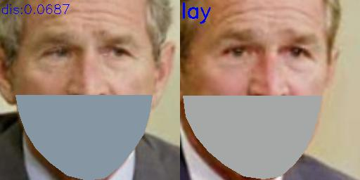 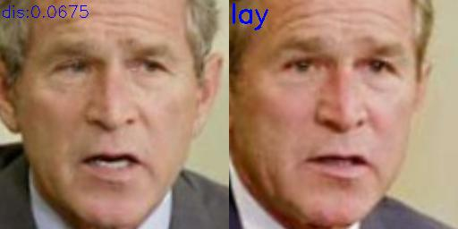<br>
<br>
戴口罩的测试图片通过V1网络FPN层的P5层特征图可视化mask/fpnP5_V2.jpg、以及通过V1网络FPN层的P6层特征图可视化mask/fpnP6_V2.jpg<br>
 <br>
戴口罩的测试图片通过V3网络最后一层卷积层的特征图可视化结果mask/V3.jpg &emsp;&emsp; 戴口罩的测试图片通过V9网络最后一层卷积层的特征图可视化结果mask/V9.jpg<br>
 
<i></i>

不戴口罩的测试图片通过V1网络FPN层的P5层特征图可视化notmask/fpnP5_V2.jpg、以及通过V1网络FPN层的P6层特征图可视化notmask/fpnP6_V2.jpg，即使输入的图片没有戴口罩网络的注意力还是放在了口罩以外的人脸区域<br>
 <br>
不戴口罩的测试图片通过V3网络最后一层卷积层的特征图可视化结果mask/V3.jpg &emsp;&emsp; 不戴口罩的测试图片通过V9网络最后一层卷积层的特征图可视化结果mask/V9.jpg<br>
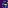 
<i></i>

### V9网络不同人向量距离结果
运行compare.py文件，设置version='V9'，就可以得到比较结果，dis是特征向量的距离<br>
V9网络戴口罩测试的结果 &emsp;&emsp;&emsp;&emsp;&emsp;&emsp;&emsp;&emsp;&emsp;&emsp;&emsp; V9网络不戴口罩测试的结果<br>
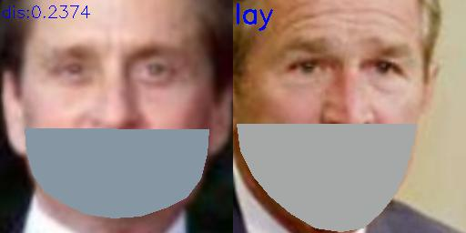 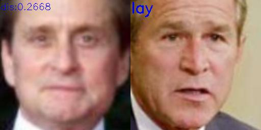<br>
<i></i>


### 使用LFW数据集验证测试集AUC结果
测试结果包含AUC、Accuray和最佳距离指标等，测试集相同但输入网络有两种图片呢，一种是戴口罩的LFW人脸图片，一种是不戴口罩的LFW人脸图片<br>

```bash
python validation_LFW.py
```
### 非LFW数据集生成LFW格式的pairs.txt文件
```bash
python create_pairs.py
```
### 使用生成的paris.txt文件验证测试非LFW数据集
```bash
python validation_NOTLFW.py
```
License
~~~~~~~
`Free software: MIT license <https://github.com/shiheyingzhe/Mask_face_recognitionZ/LICENSE>`_
Citation: YangQiHong, ZouJiu. Mask_face_recognitionZ. Git code (2020). https://github.com/shiheyingzhe/Mask_face_recognitionZ